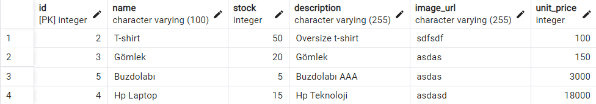

### ⚡ Inner Join

```
select p.name, c.name from product_categories pc
inner join products p
on pc.product_id = p.id
inner join categories c
on pc.category_id = c.id
```


### ⚡ Left Join

```
select * from product_chars pc
left join product_char_values pcv
on pc.id = pcv.product_char_id
```


### ⚡ Right Join

```
select pc.name, pcv.name from product_chars pc
right join product_char_values pcv
on pc.id = pcv.product_char_id
```


### ⚡ Full Outer Join

```
select p.name, p.unit_price, bi.quantity, b.total_price from basket_items bi
full outer join baskets b
on bi.basket_id = b.id
full outer join products p
on bi.product_id = p.id
```


### ⚡ Insert



```
insert into products(name, stock, description, image_url, unit_price) 
values ('Sweatshirt', 35 , 'Kapşonlu renkli sweatshirt', 'ornek_resim_url', 300)
```


### ⚡ Update

```
update products set unit_price = 270 where name = 'Sweatshirt'
```


### ⚡ In

```
select ci.name as "Şehir", ic.first_name, ic.last_name
from individual_customers ic
         inner join customers c
                    on ic.id = c.id
         inner join users us
                    on c.id = us.id
         inner join addresses ad
                    on ad.user_id = us.id
         inner join streets st
                    on ad.street_id = st.id
         inner join districts di
                    on st.district_id = di.id
         inner join towns t
                    on di.town_id = t.id
         inner join cities ci
                    on t.city_id = ci.id
where ci.name in ('Ankara', 'İstanbul')
```


### ⚡ Between

```
select name, unit_price
from products
where unit_price between 50 and 200
```


### ⚡ Group By

```
select ci.name as "Şehir", count(*) "Müşteri Sayısı"
from cities ci
         inner join towns tw
                    on ci.id = tw.city_id
         inner join districts di
                    on tw.id = di.town_id
         inner join streets st
                    on di.id = st.district_id
         inner join addresses ad
                    on st.id = ad.street_id
         inner join users us
                    on us.id = ad.user_id
         inner join customers cu
                    on us.id = cu.id
group by ci.name
```


